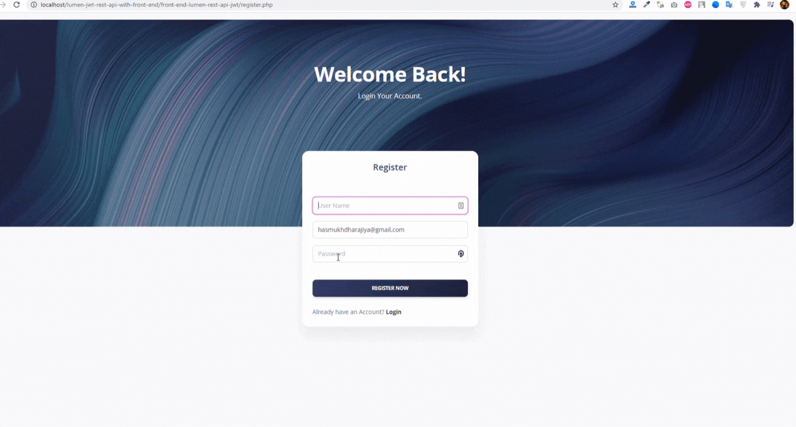

# laravel_passport_rest_api_with_front_end
Complete Real world REST API in Laravel 8.x(with Passport) with Back-End And Front-End integration. Building a robust restful API in Laravel using Passport Authentication. Frontend Project using JQuery and Ajax.

## How to use

1. Clone the repository with following path `C:\xampp\htdocs`
2. git clone `git clone https://github.com/hasmukh-dharajiya/laravel_passport_rest_api_with_front_end.git`
3. Open `laravel_passport_rest_api_with_front_end/back-end-with-passport-rest-apis`
4. Copy `.env.example file to .env`
5. Edit database credentials in .env file `DB_DATABASE=dashboard`
6. Run `composer install`
7. Run `php artisan key:generate`
8. Run `php artisan passport:install`
9. Run `php artisan migrate`
10. Run `php artisan ser`
11. Open xampp and Start Apache Server
12. Run **login.php** in laravel_passport_rest_api_with_front_end/front-end-with-php-ajax-integration Folder `http://localhost/laravel_passport_rest_api_with_front_end/front-end-with-php-ajax-integration/register.php`

All Set First Register With Email and Password.

`Note`: Make Sure Laravel backend Project Run In Background (Testing: http://127.0.0.1:8000/).

## Feature
Key Feature of Project.

- Backend API using Laravel with Passport.
- Real World Calling Api with Front End Dashboard
- Custom Authentication System (without jetstream)
- Register,Login And Dashboard Design
- Run Local Environment
- Responsive Template
- Use Real-World Project
- Authorized User Using Passport Token.
- Front End Project Call Laravel passport Api using AJAX.

## Login View
`http://localhost/laravel_passport_rest_api_with_front_end/front-end-with-php-ajax-integration/register.php`

## Dashboard View
`http://localhost/laravel_passport_rest_api_with_front_end/front-end-with-php-ajax-integration/user/index.php`

